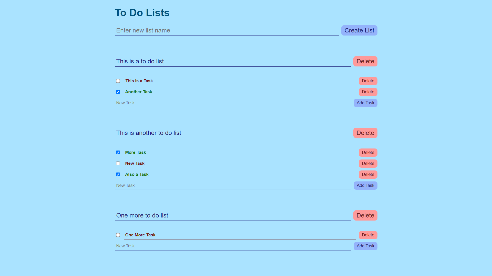

## To DO List Web Application

A Simple To Do List App where users can:
* Create, Rename or Delete Lists
* Add, Remove or Rename Tasks
* Mark tasks as Complete or Incomplete

### Tech Stack:

* [MarkLogic Server](https://developer.marklogic.com/products/marklogic-server) as database
    * To store data in XML format
* [Express.js](https://expressjs.com/) in [Node.js](https://nodejs.org/) as backend
    * Takes care of conversion of data between XML format for database and JSON format for frontend
    * Create API endpoints for creation, renaming, deletion of lists and tasks as well as for marking tasks as complete or incomplete
* [React](https://react.dev/) to build the frontend
    * Sends request to backend endpoints based on user input events and handles the responce
    * Conditional Rendering of To Do Lists and Task components
    * Styling with CSS for great visual design

---
##### **MainFlow Services and Technologies**
### Full Stack Web Development Internship Task 4

**Description:** Develop a simple to-do list
application where users can add tasks, mark tasks
as completed, and delete tasks.

**Implementation:**
1. Create a React component for the to-do list.
2. Use React state (useState hook) to manage the list of
tasks.
3. Implement event handlers for adding, completing, and
deleting tasks.
4. Use conditional rendering to display completed tasks
differently.
5. Apply basic CSS for styling the to-do list and task items.

### Usage:

#### Prerequisites:
* [MarkLogic Server](https://developer.marklogic.com/products/marklogic-server) must be set up and running with a new database created for the To Do List App.
* [Node JS](https://nodejs.org/) must be installed and `npm` and `npx` should be executable from Command Line.
* [Git](https://git-scm.com/downloads) must be installed to clone this repository or download the code from this repository directly.


#### Clone the repository:
```
git clone https://github.com/himdek/to-do-app/
```

#### Create `.env` file
Replace values as necessary or according to your database setup
```
cd to-do-app
echo "
FRONTEND_URL=http://localhost:3000
BACKEND_PORT=3001
MARKLOGIC_USER=replace_user_name
MARKLOGIC_PASSWORD=replace_password
MARKLOGIC_HOST=localhost
MARKLOGIC_PORT=8000
MARKLOGIC_AUTH_TYPE=digest
MARKLOGIC_DATABASE=replace_database_name
" > .env
```
Make sure variables from `.env` are loaded into your environment.


#### Run Backend Server:
```
cd backend
npm install
npm run serve
```

#### Run Frontend Server:
```
cd frontend
echo "REACT_APP_BACKEND_URL=http://localhost:3001" > .env
npm install
npm run build
npm install -g serve
serve -s build
```

#### Access the app:
Visit [localhost:3000](http://localhost:3000) or whatever host you deployed to.

### Screenshot:
